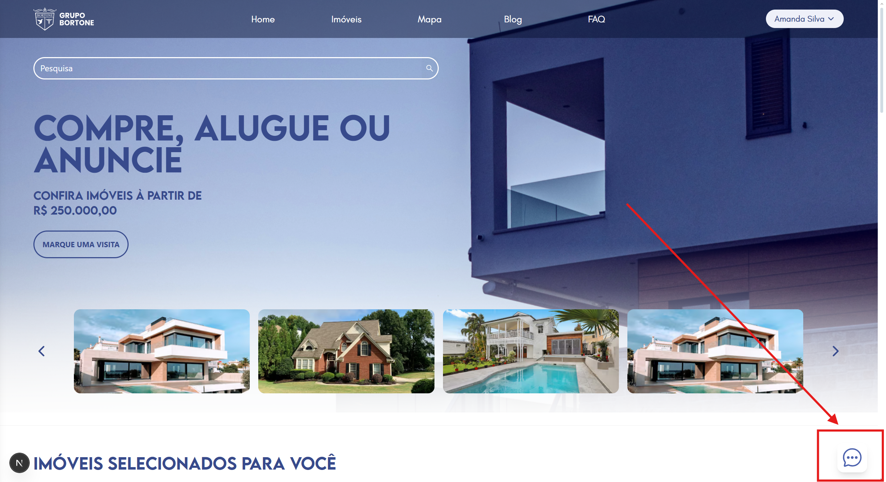
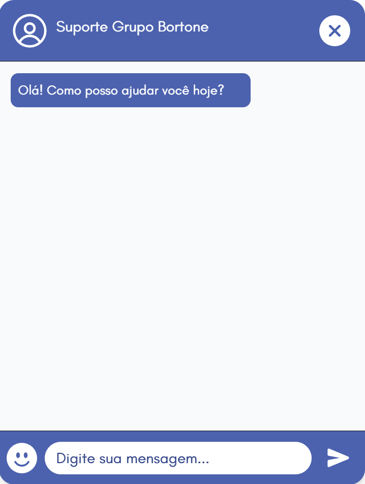

# Chat Suporte

## Descrição do Chat 

Esta seção é responsável pelo canal de comunicação em tempo real entre o cliente e a equipe de atendimento. 

## Objetivo do Chat

- O cliente pode sanar dúvidas ou resolver problemas rapidamente.
- Melhorar a experiência do cliente, dando mais confiança e satisfação ao ter alguém disponível para ajudar.

## Como Executar o Servidor

### Backend:

- Acesse a Pasta do Backend
```bash
cd back-end
```

- Instale as Dependências
```bash
npm install
```

- Rode o Servidor 
```bash
npm run dev
```

### Frontend:

- Acesse a pasta do Frontend
```bash
cd frontend
```

- Instale as Dependências
```bash
npm install
```

- Rode o Front
```bash
npm run dev
```

## Eventos WebSocket

### Mensagem

```js
ws.on("message", ...)
```
Esse evento é disparado toda vez que o cliente ou atendente enviam uma mensagem para o servidor

### Fechamento

```js

ws.on("close", ...)
```
Esse evento é disparado quando a conexão é fechada seja pelo cliente ou pelo servidor.

## Funcionalidades do Chat

- O Chat conta com histórico salvo para as últimas 100 mensagens enviadas após finalizar a sessão.
- Possui filtro de mensagens inadequadas.
- Limita o número de caracteres inseridos a 500.
- Possui filtro de caracteres especiais.

## Uso do Frontend

### Acesse o Projeto e clique no botão do Chat:


### Pronto! Agora é só informar a sua dúvida ao atendente
